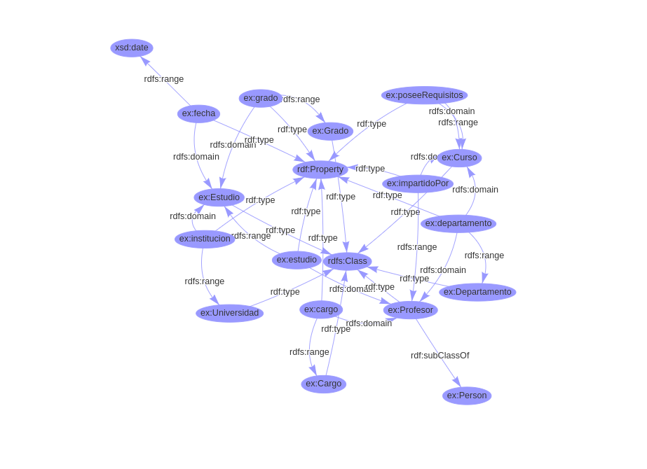
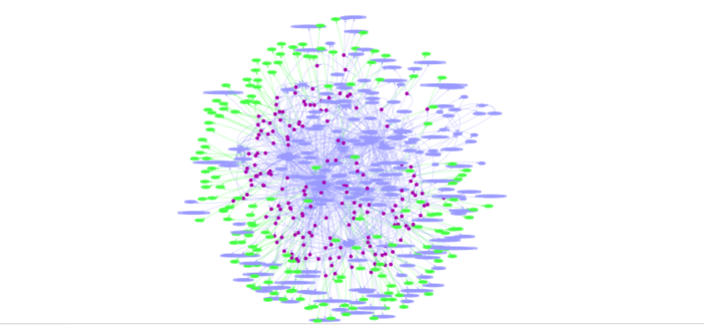
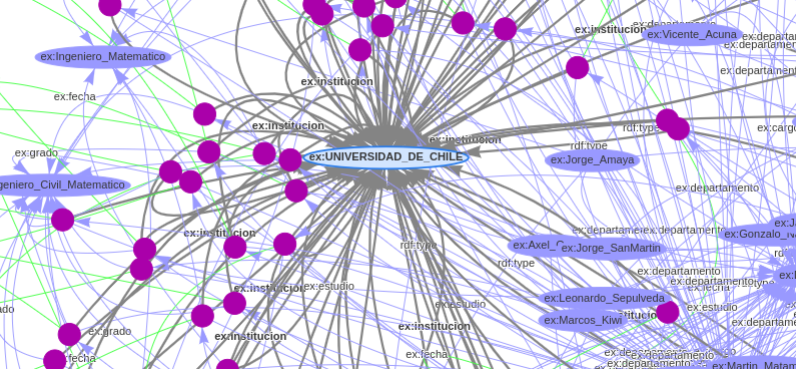
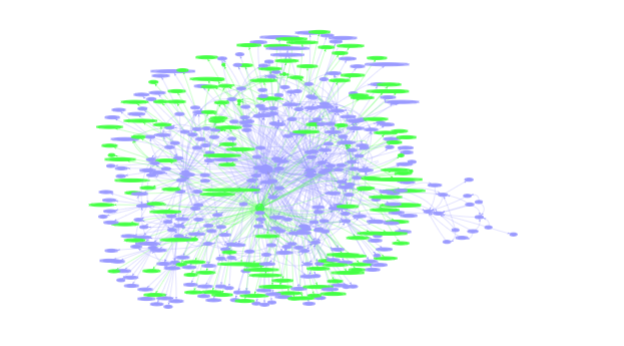
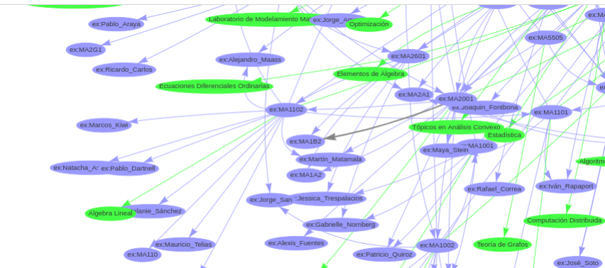

# Proyecto-Watos

## Descripción

Este proyecto es parte del curso de Linked Data (CC7220) y tiene como objetivo extraer información de U-Campus y el portal de la Universidad de Chile para obtener datos sobre cursos y profesores de la Facultad de Ciencias Físicas y Matemáticas (FCFM). La meta es generar un grafo RDF con dicha información.

## Estructura del Proyecto

- `/scrapping`: Contiene los scripts de scraping.
- `/outputs`: Almacena los datos extraídos en formato csv.

## Instalación

1. Clona el repositorio:
    ```bash
    git clone https://github.com/tu-usuario/Proyecto-Watos.git
    ```
2. Instala las dependencias:
    ```bash
    cd Proyecto-Watos
    pip install -r requirements.txt
    ```

## Uso

1. Ejecuta el script de scraping:
    para profesores
    ```bash
    python scraping/scraper_professors.py DIM  # DIM es el departamento de interés (el alcance del proyecto es DIM, DCC )
    python scraping/scraper_courses.py DIM  
    ```
3. Ejecutar scripts de limpieza de datos:
    ```bash
    python cleaning/FormateodeCursos.py
    python cleaning/professors_formating.py
    ```
4. Considerar que algunos detalles se arreglaron a mano  por su dificultad de estandarización. Entre ellos, se setea a mano el nombre de los profesores Nombre_Apellido. Profesor flavio Guinez se establece su grado a mano como "Licenciado_en_Ciencias_con_mencion_en_Matematicas", algunos requisitos se scrapearon como codigos (ie CC4102) en vez de ints.

5. Ejecutar scripts de generación de RDF:
    ```bash
    python rdf/rdf_generator.py
    
    ```
Se considera el siguiente esquema  para el modelado de datos:
```bash
@base <http://example.org/> .
@prefix rdf: <http://www.w3.org/1999/02/22-rdf-syntax-ns#> .
@prefix xsd: <http://www.w3.org/2001/XMLSchema#> .
@prefix rdfs: <http://www.w3.org/2000/01/rdf-schema#> .
@prefix ex: <http://www.example.org/ontology#> .

ex:Profesor rdf:type rdfs:Class; rdf:subClassOf ex:Person.
ex:Cargo rdf:type rdfs:Class .
ex:Grado rdf:type rdfs:Class .
ex:Departamento rdf:type rdfs:Class .
ex:Curso rdf:type rdfs:Class .
ex:Universidad rdf:type rdfs:Class .
ex:Estudio rdf:type rdfs:Class .

#Propiedades
#profesor
ex:departamento rdf:type rdf:Property ;
    rdfs:domain ex:Profesor ;
    rdfs:range ex:Departamento .

ex:cargo rdf:type rdf:Property ;
    rdfs:domain ex:Profesor ;
    rdfs:range ex:Cargo .

ex:estudio rdf:type rdf:Property ;
    rdfs:domain ex:Profesor ;
    rdfs:range ex:Estudio .

#Estudio
ex:fecha rdf:type rdf:Property ;
    rdfs:domain ex:Estudio ;
    rdfs:range xsd:date .

ex:institucion rdf:type rdf:Property ;
    rdfs:domain ex:Estudio ;
    rdfs:range ex:Universidad .

ex:grado rdf:type rdf:Property ;
    rdfs:domain ex:Estudio ;
    rdfs:range ex:Grado .

#Curso
ex:departamento rdf:type rdf:Property ;
    rdfs:domain ex:Curso ;
    rdfs:range ex:Departamento .
ex:impartidoPor rdf:type rdf:Property ;
    rdfs:domain ex:Curso ;
    rdfs:range ex:Profesor .

ex:poseeRequisitos rdf:type rdf:Property ;
    rdfs:domain ex:Curso ;
    rdfs:range ex:Curso .


```


## Consideraciones Importantes:

Se hicieron simplificaciones para acotar el alcance del proyecto. Entre estas se consideran todas  los requisitos de cursos como un y lógico (ya sea / o ,).

## Resultados y visualizaciones
A partir del ttl  generado se generaron visualizaciones en formato png con el rdfplayground. 

### Profesores
Ocupando solo las tripletas de los profesores se generó el siguiente grafo:





Todos los profesores que realizaron algun grado en la Universidad de Chile
### Cursos
Ocupando  solo las tripletas de los cursos se generó el siguiente grafo:





Lamentablemente no se logró generar un grafo con los profesores, cursos y sus relaciones.Debido a las limitaciones del playgroubd :( .

## Consultas Sparql
Se realizaron una serie de consultas, que se encuentran en la carpeta "results".

## Licencia

Este proyecto está bajo la Licencia MIT. Consulta el archivo `LICENSE` para más detalles.

